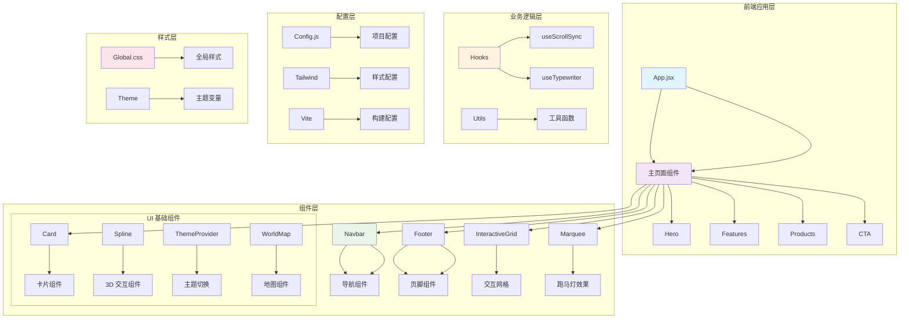

# AI 企业站点 React 项目

## 项目愿景

基于 React 18 和现代前端技术栈构建的企业级 AI 产品展示网站，提供沉浸式的用户体验和丰富的交互功能。

## 架构总览

### 技术栈
- **前端框架**: React 18.3.1 + Vite 5.4.2
- **样式方案**: Tailwind CSS 4.1.15 + PostCSS 8.5.6
- **开发语言**: TypeScript 5.9.3 + JavaScript ES6+
- **UI 组件**: 自定义组件 + shadcn/ui 基础组件
- **动画库**: Framer Motion 12.23.24
- **图标库**: Lucide React 0.546.0
- **3D 交互**: @splinetool/react-spline 4.1.0
- **主题切换**: next-themes 0.4.6

### 项目特性
- 🎨 现代化的响应式设计
- 🚀 基于 Vite 的快速开发构建
- 🌙 暗黑/亮色主题切换
- 🎯 丰富的动画和交互效果
- 🌍 全球化地图可视化
- 📱 完全响应式布局
- ♿️ 无障碍访问支持

## 模块索引

### 核心模块
- `/src/components/` - 主要业务组件模块
- `/src/hooks/` - 自定义 React Hooks
- `/src/lib/` - 工具函数和配置
- `/src/styles/` - 全局样式定义

### 关键组件
- `Hero.jsx` - 首页主视觉组件
- `Features.jsx` - 产品特性展示
- `Products.jsx` - 产品展示组件
- `CTA.jsx` - 行动号召组件
- `Navbar.jsx` - 导航栏组件
- `Footer.jsx` - 页脚组件
- `InteractiveGrid.jsx` - 交互式网格
- `Marquee.jsx` - 跑马灯效果

### UI 组件库
- `ui/` - 基于 shadcn/ui 的基础组件
  - `card.tsx` - 卡片组件
  - `spline.tsx` - Spline 3D 组件
  - `theme-provider.tsx` - 主题提供者
  - `world-map.tsx` - 世界地图组件

### 核心工具
- `config.js` - 项目配置文件
- `lib/utils.ts` - 工具函数集合
- `hooks/useScrollSync.js` - 滚动同步 Hook
- `hooks/useTypewriter.js` - 打字机效果 Hook

## 全局规范

### 代码规范
- 使用 TypeScript 进行类型安全开发
- 遵循 ESLint 和 Prettier 配置
- 组件使用函数式组件和 Hooks
- 组件命名采用 PascalCase
- 文件命名采用 kebab-case

### 样式规范
- 基于 Tailwind CSS 的原子化样式
- 使用 CSS Variables 实现主题切换
- 响应式设计采用移动优先策略
- 动画使用 Framer Motion 实现

### 项目结构
```
src/
├── components/          # 业务组件
├── components/ui/       # UI 基础组件
├── hooks/               # 自定义 Hooks
├── lib/                 # 工具函数
├── styles/              # 样式文件
├── config.js            # 项目配置
├── App.jsx              # 主应用组件
└── main.jsx             # 应用入口
```

### 开发流程
1. 使用 `npm run dev` 启动开发服务器
2. 使用 `npm run build` 构建生产版本
3. 使用 `npm run preview` 预览构建结果
4. 遵循组件化开发原则
5. 保持代码风格一致性

## 项目架构图



## 构建配置

### Vite 配置
- 基于插件 React 快速构建
- 支持热模块替换
- 代码分割和懒加载
- 静态资源优化

### TypeScript 配置
- 启用严格模式
- JSX 支持配置
- 路径别名设置
- 类型声明文件

## 部署准备

项目构建完成后，将生成优化的静态文件，可以直接部署到静态托管服务（如 Vercel、Netlify 等）。

## 维护指南

- 定期更新依赖包
- 保持组件文档更新
- 遵循代码规范进行提交
- 及时修复安全漏洞

---

**最后更新**: 2025年10月23日 15:14:47
**维护者**: AI 助手